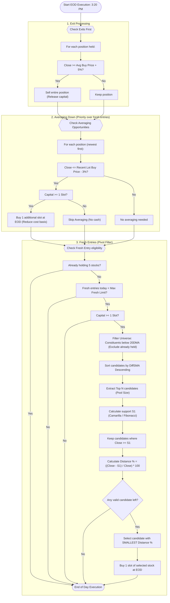

# NiftyShop V-Pivot Playbook

NiftyShop V-Pivot is an optimized, rule-based equity mean-reversion strategy. It enhances the standard NiftyShop strategy by introducing a **Pivot Support Entry Filter** to enter positions close to key price supports.

---

## 1. Strategy Philosophy
The strategy combines traditional mean reversion (buying oversold stocks) with structural price levels (Pivot Points):
* **Support Clustering**: A stock is most likely to experience a swift bounce-back if it is trading immediately above a major historical support line (Pivot Point).
* **Capital Velocity**: By entering trades close to supports, we reduce holding times and accelerate capital recycling.

---

## 2. Core Index & Configuration Recommendations

Based on 5-year (2021-2025) and 8-year (2018-2025) historical backtesting, the following indices and configurations are recommended:

### **A. Primary Choice: Nifty 50 (Large Cap)**
* **Recommended Pivot Config**: **Camarilla S1 (Pool Size 5)**
* **Performance (8-Year: 2018-2025)**: **16.01% CAGR** (vs. 7.84% Standard NiftyShop, and 12.16% Index Buy-and-Hold)
* **Alpha vs. Index**: **+3.85% CAGR** (Outperforms Standard by **+8.17% CAGR**)
* **Why it works**: Large-cap stocks are highly liquid. Setting a tight pool size of **5** ensures focus on the most oversold heavyweights. **Camarilla S1** is a tight support level that acts as a soft filter; it allows the strategy to stay invested during steep corrections (like the 2018 correction and 2020 COVID crash), capturing maximum returns on recovery.

### **B. Secondary Choice: Nifty Midcap 50 (Mid Cap)**
* **Recommended Pivot Config**: **Fibonacci S1 (Pool Size 15)**
* **Performance (5-Year: 2021-2025)**: **24.34% CAGR** (vs. 15.50% Standard NiftyShop, and 22.91% Index Buy-and-Hold)
* **Why it works**: Mid-cap stocks are more volatile. A larger pool size of **15** gives the engine the flexibility to ignore "falling knives" and find a stock that is safely resting on a support level.

---

## 3. Entry Rules

1. **Universe Filter**: Only trade stocks belonging to the active Nifty 50 or Nifty Midcap 50 index.
2. **Setup Condition**: The stock's EOD Close price must be below its 20-day Simple Moving Average (20DMA).
3. **Portfolio Limit**: Maximum of 5 unique stocks held simultaneously.
4. **Candidate Selection**:
   * Rank all eligible stocks below their 20DMA by distance descending (`DiffSMA` descending).
   * Filter out stocks that are already in the portfolio.
   * Extract the **top $N$ candidates** (where $N = 5$ for Nifty 50, and $N = 15$ for Midcap 50).
5. **Support Proximity Calculation**:
   * For each of the top $N$ stocks, calculate the support level using the previous day's High ($H$), Low ($L$), and Close ($C$):
     * **For Nifty 50 (Camarilla S1)**:
       $$S_1 = C - (H - L) \times \frac{1.1}{12}$$
     * **For Nifty Midcap 50 (Fibonacci S1)**:
       $$P = \frac{H + L + C}{3}$$
       $$S_1 = P - 0.382 \times (H - L)$$
   * Ensure $\text{Close} \ge S_1$. If a stock has fallen below its $S_1$ level, it is disqualified.
   * Calculate the percentage distance to the support line:
     $$\text{Distance (\%)} = \frac{\text{Close} - S_1}{\text{Close}} \times 100$$
6. **Execution**: Buy the single stock with the **smallest distance** (closest support) at the EOD window (3:20 PM - 3:30 PM).

---

## 4. Averaging Rules (Priority Over New Entries)
If a held stock continues to fall, average down to reduce the cost basis:
* **Trigger**: A held stock drops $\ge 3\%$ below its **most recent** purchase price.
* **Execution**: Buy an additional slot of the stock at the EOD window.
* **Prioritization**: When capital is constrained, averaging down on an existing position takes priority over taking a fresh entry.

---

## 5. Exit & Profit Booking Rules
* **Target Exit**: Sell the entire position when the stock price hits a **5% profit** relative to the **weighted average buy price** (cost basis).
* **Order of Operations**: Process exits before entries. Capital from same-day exits can be instantly re-deployed.

---

## 6. Execution Flow Chart

The following Mermaid diagram outlines the End-of-Day (EOD) execution process of the NiftyShop V-Pivot strategy:

---

## 7. Concrete Example Cases

### Case 1: Camarilla S1 (Nifty 50)
* **Configuration**: `system: "camarilla"`, `level: "S1"`, `pool_size: 5`
* **Scenario**: Portfolio holds 3 stocks (2 slots free). The system scans the Nifty 50 universe and finds 6 stocks below their 20DMA.

#### 1. Candidate List & Sorting (by `DiffSMA` Descending)
| Rank | Symbol | Close | 20DMA | DiffSMA (%) | Prev. Day High (H) | Prev. Day Low (L) | Prev. Day Close (C) |
|---|---|---|---|---|---|---|---|
| 1 | **STOCK_A** | 100.00 | 110.00 | 9.09% | 105.00 | 95.00 | 101.00 |
| 2 | **STOCK_B** | 200.00 | 210.00 | 4.76% | 208.00 | 196.00 | 202.00 |
| 3 | **STOCK_C** | 300.00 | 312.00 | 3.85% | 305.00 | 295.00 | 298.00 |
| 4 | **STOCK_D** | 400.00 | 410.00 | 2.44% | 402.00 | 392.00 | 397.00 |
| 5 | **STOCK_E** | 500.00 | 505.00 | 0.99% | 502.00 | 498.00 | 499.00 |
| 6 | **STOCK_F** | 600.00 | 603.00 | 0.50% | 601.00 | 598.00 | 600.00 |

#### 2. Pool Selection
With `pool_size: 5`, we extract the top 5 sorted candidates: **STOCK_A**, **STOCK_B**, **STOCK_C**, **STOCK_D**, and **STOCK_E**. (STOCK_F is excluded from the pool).

#### 3. Support Level & Distance Calculations
Camarilla S1 formula:
$$S_1 = C - (H - L) \times \frac{1.1}{12}$$

* **STOCK_A**:
  * $S_1 = 101.00 - (105.00 - 95.00) \times \frac{1.1}{12} = 101.00 - 10.00 \times 0.09167 = 100.083$
  * **Check**: $\text{Close } (100.00) < S_1 \ (100.083)$ &rarr; **Disqualified** (broke support).
* **STOCK_B**:
  * $S_1 = 202.00 - (208.00 - 196.00) \times \frac{1.1}{12} = 202.00 - 12.00 \times 0.09167 = 200.90$
  * **Check**: $\text{Close } (200.00) < S_1 \ (200.90)$ &rarr; **Disqualified** (broke support).
* **STOCK_C**:
  * $S_1 = 298.00 - (305.00 - 295.00) \times \frac{1.1}{12} = 298.00 - 10.00 \times 0.09167 = 297.083$
  * **Check**: $\text{Close } (300.00) \ge S_1 \ (297.083)$ &rarr; **Valid**.
  * **Distance (%)**: $\frac{300.00 - 297.083}{300.00} \times 100 = 0.972\%$
* **STOCK_D**:
  * $S_1 = 397.00 - (402.00 - 392.00) \times \frac{1.1}{12} = 397.00 - 10.00 \times 0.09167 = 396.083$
  * **Check**: $\text{Close } (400.00) \ge S_1 \ (396.083)$ &rarr; **Valid**.
  * **Distance (%)**: $\frac{400.00 - 396.083}{400.00} \times 100 = 0.979\%$
* **STOCK_E**:
  * $S_1 = 499.00 - (502.00 - 498.00) \times \frac{1.1}{12} = 499.00 - 4.00 \times 0.09167 = 498.633$
  * **Check**: $\text{Close } (500.00) \ge S_1 \ (498.633)$ &rarr; **Valid**.
  * **Distance (%)**: $\frac{500.00 - 498.633}{500.00} \times 100 = 0.273\%$

#### 4. Selection Result
The system compares the valid candidates by distance ascending:
* **STOCK_E**: 0.273%
* **STOCK_C**: 0.972%
* **STOCK_D**: 0.979%

**Execution**: The strategy enters **STOCK_E** because it is closest to its Camarilla S1 support line, despite STOCK_A and STOCK_B having a larger deviation from their 20DMAs (but having broken below support).

---

### Case 2: Fibonacci S1 (Midcap 50)
* **Configuration**: `system: "fibonacci"`, `level: "S1"`, `pool_size: 5`
* **Scenario**: Finding the best candidate to buy.

#### Support Level Calculation
Fibonacci S1 formula:
$$P = \frac{H + L + C}{3}$$
$$S_1 = P - 0.382 \times (H - L)$$

* **STOCK_X**: Close = 100.00, Prev. Day High = 110.00, Low = 90.00, Close = 95.00.
  * $P = \frac{110.00 + 90.00 + 95.00}{3} = 98.333$
  * $S_1 = 98.333 - 0.382 \times 20.00 = 98.333 - 7.64 = 90.693$
  * **Check**: $\text{Close } (100.00) \ge S_1 \ (90.693)$ &rarr; **Valid**.
  * **Distance (%)**: $\frac{100.00 - 90.693}{100.00} \times 100 = 9.307\%$
* **STOCK_Y**: Close = 100.00, Prev. Day High = 103.00, Low = 97.00, Close = 98.00.
  * $P = \frac{103.00 + 97.00 + 98.00}{3} = 99.333$
  * $S_1 = 99.333 - 0.382 \times 6.00 = 99.333 - 2.292 = 97.041$
  * **Check**: $\text{Close } (100.00) \ge S_1 \ (97.041)$ &rarr; **Valid**.
  * **Distance (%)**: $\frac{100.00 - 97.041}{100.00} \times 100 = 2.959\%$

**Execution**: The strategy enters **STOCK_Y** (Distance = 2.959%) instead of **STOCK_X** (Distance = 9.307%).

---

### Case 3: Averaging Down Process
* **Configuration**: `avg_trigger_pct: 0.03` (3%)
* **Scenario**: Active position in STOCK_Z.
  1. **Day 1**: Purchased 1st slot of STOCK_Z at **100.00**.
  2. **Day 2**: STOCK_Z drops to **98.00** (-2%). Close is not &le; 97.00. **No action**.
  3. **Day 3**: STOCK_Z drops to **96.50** (-3.5%).
     * **Trigger Check**: EOD Close (96.50) &le; Recent Purchase Price (100.00) &times; 0.97 (97.00). **Averaging Triggered**.
     * **Execution**: Purchase a 2nd slot at **96.50**.
     * **New Cost Basis**: $\frac{100.00 + 96.50}{2} = 98.25$.
     * **Target Exit Price**: $98.25 \times 1.05 = 103.16$.

